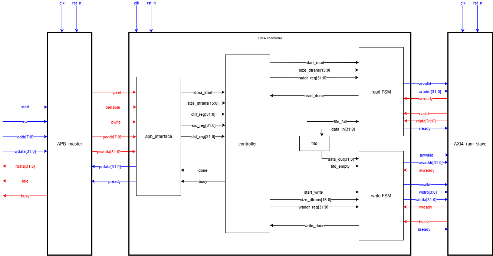

# DMA - Direct Memory Access

## Overview
This project implements a **Direct Memory Access (DMA) controller** written in Verilog HDL.  
The DMA transfers data from a source address to a destination address using **AXI4 read/write interfaces**, with configuration provided via **APB registers**.

**Key Features:**
- **APB Register Interface** for configuration and status.
- **AXI4 Read/Write Interfaces** for high-throughput data transfer.
- **FIFO Buffer** for decoupling read/write and handling AXI4 latency.
- **Controller FSM** for managing transfer flow.
- **Self-Checking Testbench** using `apb_master`.
---

## Block Diagram

---
## Structure
````
dma_controller/
├──NguyenBaoTinh_Lab5_DMA_design.png
├──Makefile
├──README.md
├──RTL/
│   ├── apb_interface.v
│   ├── apb_master.v
│   ├── axi4_ram_slave.v
│   ├── controller.v
│   ├── dma_controller.v
│   ├── fifo.v
│   ├── read_axi4_interface.v
│   ├── write_axi4_interface.v
│   └── dma_controller_tb.v     
````
---
## Register Map
| Address | Register            | Description                              |
|---------|---------------------|------------------------------------------|
| 0x00    | **Control**         | [31:16] Transfer Size (bytes), [0] Start |
| 0x04    | **Status**          | [1] Done, [0] Busy                       |
| 0x08    | **Source**          | Source Address (4-byte aligned)          |
| 0x0C    | **Destination**     | Destination Address (4-byte aligned)     |
---


## How to Simulate
1. **Chọn Testbench**  
   - Trong `Makefile`, set `TOP_TB` thành tên testbench cần chạy (mặc định là `dma_controller_tb`):
   ```bash
   TOP_TB ?= dma_controller_tb
2. **Build & Run Simulation**
   ```bash
   make run     # Compile và chạy mô phỏng
3. **Waveform Viewer**
   ```bash
   make wave
4. **Clean**
   ```bash
   make clean
---

## Testbench
- apb_master.v configures the DMA via APB writes.
- Verifies end-to-end data transfer from source to destination.
- Self-checking testbench compares expected vs. received data.
---

## Tools & Environment
- **Simulator:** Icarus Verilog (iverilog, vvp)
- **Waveform Viewer:** GTKWave
- **Automation:** GNU Make (Makefile for build and run)
- **OS:** Linux (Ubuntu recommended)
---
## Author
Nguyen Bao Tinh - Training project from VNCHIP RTL Program(2025)

Supported by Mr. Quang Le and teaching assistants in VNCHIP
